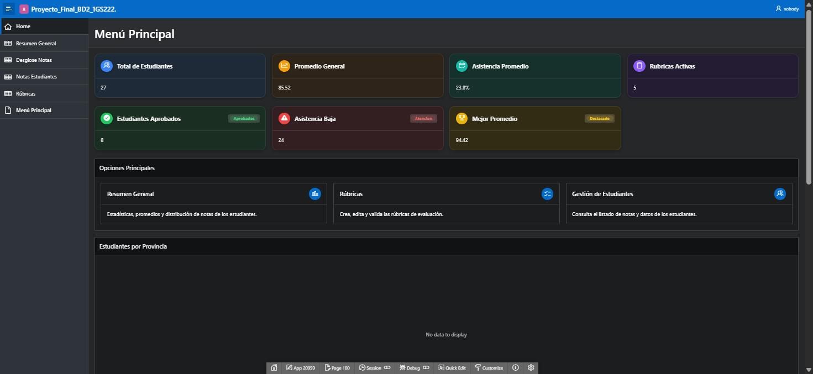
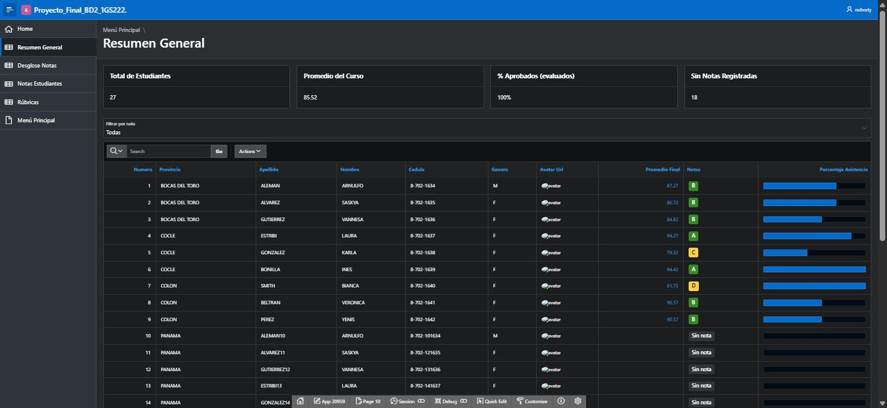
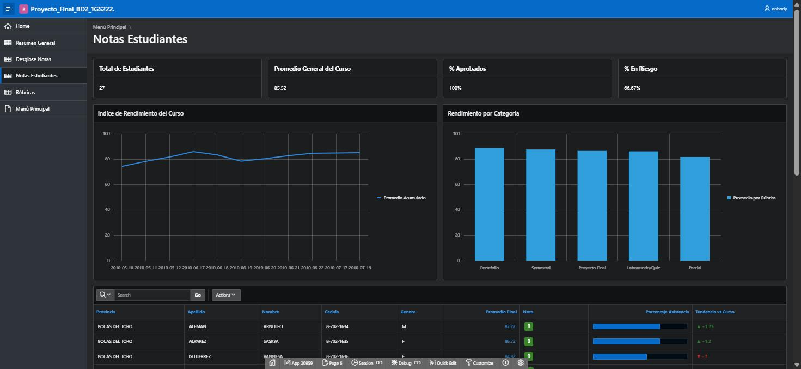
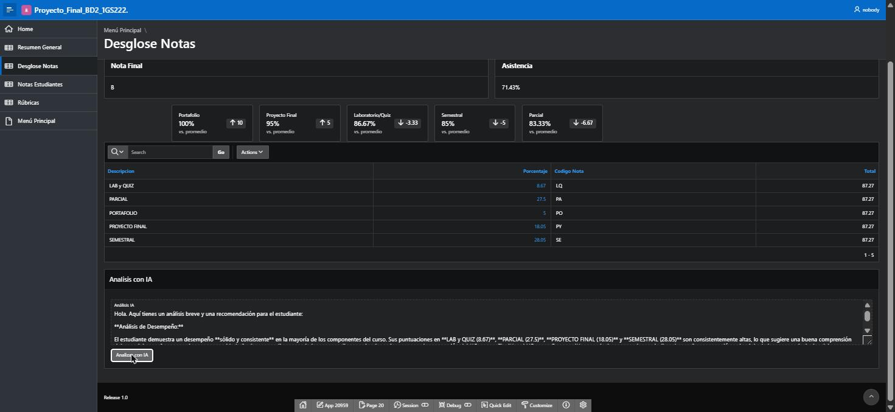
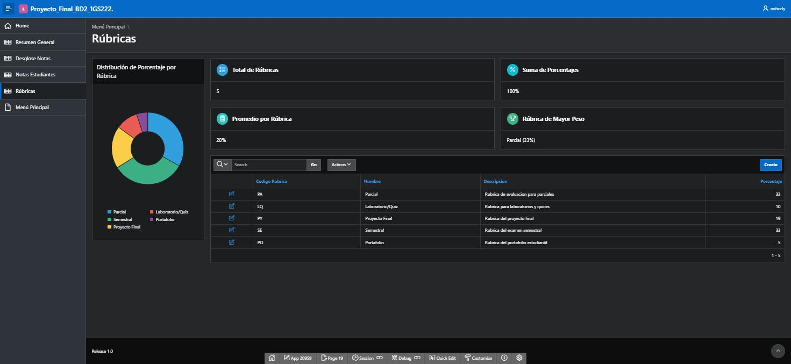
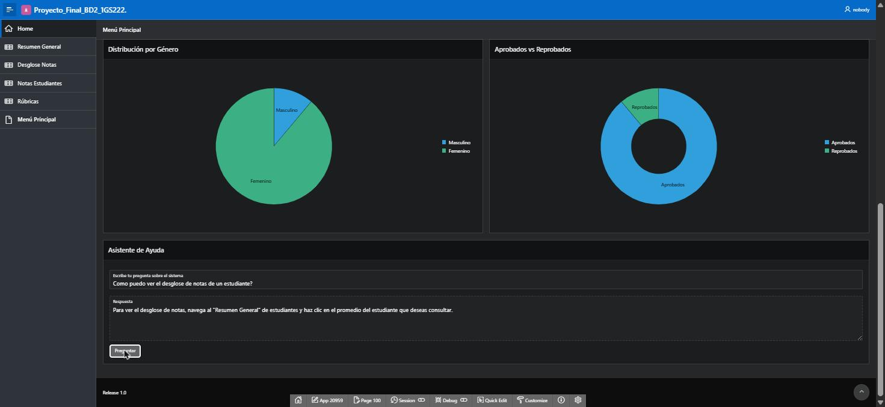
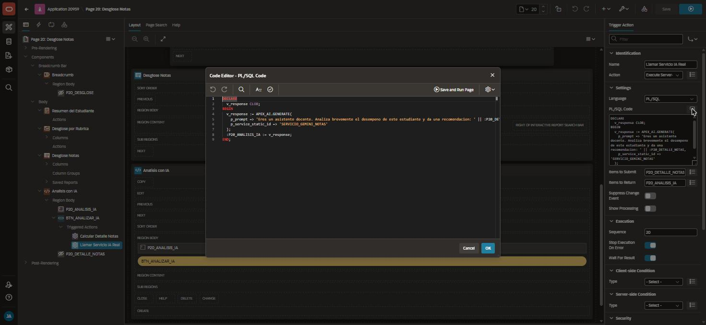

# 🎓 Sistema de Gestión de Calificaciones — Oracle APEX + IA

> **Proyecto Final — Base de Datos II** · Universidad Tecnológica de Panamá (UTP)
> Lic. Desarrollo y Gestión de Software · Grupo 1GS222 · 2026 - I Semestre

Aplicación completa construida en **Oracle APEX 26** para la gestión de calificaciones y estudiantes, evolucionada desde el proyecto base de Base de Datos I con mejoras de rendimiento SQL, experiencia de usuario moderna (tema oscuro, dashboards, gráficos interactivos) y **tres integraciones reales de Inteligencia Artificial** con Oracle APEX AI + Google Gemini.



## 🔗 Demo en vivo

**➡️ [Abrir la aplicación](https://oracleapex.com/ords/r/bd2_apex/proyecto-final-bd2-1gs222/)** — desplegada en oracleapex.com.

> 🔒 Las credenciales de acceso no se publican en este repositorio; se entregan junto con el documento técnico del proyecto.

---

## ✨ Características

| Módulo | Descripción |
|---|---|
| 📊 **Menú Principal (dashboard)** | KPIs en vivo (estudiantes, promedio, asistencia, rúbricas), 3 gráficos (provincia, género, aprobados) y asistente de ayuda con IA |
| 📋 **Resumen General** | Reporte interactivo con badges de color por nota (A-F), barras de asistencia y filtro rápido por letra |
| 📈 **Notas Estudiantes** | Índice de rendimiento del curso (línea), rendimiento por categoría (barras) y tendencia por estudiante vs el promedio |
| 🔍 **Desglose de Notas** | Modal con el detalle por rúbrica del estudiante + **análisis de desempeño generado por IA** |
| 🗓️ **Nota Individual** | Historial de calificaciones por fecha para cada criterio de evaluación |
| 🏷️ **Rúbricas** | CRUD de rúbricas con gráfico de distribución y **descripciones generadas con IA** |

## 🤖 Los 3 usos de Inteligencia Artificial

1. **Asistente de Desempeño Estudiantil** — `APEX_AI.GENERATE` en PL/SQL: analiza las notas reales del estudiante y genera fortalezas, debilidades y una recomendación docente.
2. **Generador de descripciones de rúbrica** — botón nativo *Generate with AI* en el formulario de rúbricas.
3. **Asistente de Ayuda (chatbot)** — Dynamic Action nativa *Generate Text with AI* en el menú principal: responde preguntas sobre cómo usar el sistema, 100% declarativo (cero código).

Servicio: **Google Gemini** (`gemini-2.5-flash`) configurado como Generative AI Service del workspace.

## 🚀 Cómo levantar la aplicación

### Método rápido (importar el export completo)

1. **Base de datos**: en tu workspace de APEX → `SQL Workshop > SQL Scripts > Upload` → sube [`script_base_proyecto_v2.sql`](script_base_proyecto_v2.sql) → **Run** (córrelo 2 veces la primera vez: los `DROP` iniciales fallan porque las tablas aún no existen).
2. **Aplicación**: `App Builder > Import` → sube [`f20959.sql`](f20959.sql) → *Database Application* → **Install**.
3. **IA (opcional)**: `Workspace Utilities > Generative AI Services` → abre *Servicio Gemini Notas* y registra tu propia API key de [Google AI Studio](https://aistudio.google.com/) (la key nunca viaja en el export, por seguridad).
4. **Listo** ✅ — ejecuta la app y verifica el dashboard, la navegación y los botones de IA.

### Método educativo (construirla paso a paso)

El documento técnico del proyecto (entregado con el curso) contiene la guía completa y reproducible: creación del workspace, carga del script, creación de la app, cada página clic por clic (con capturas reales del Page Designer), las mejoras SQL con su antes/después, y el capítulo obligatorio **"Desarrollado con IA"** con prompts y evidencias. Las capturas de ese proceso están en [`capturas/app/`](capturas/app/).

## 📁 Estructura del repositorio

```
├── README.md                    ← estás aquí
├── f20959.sql                   ← export completo de la app APEX (Full Export)
├── script_base_proyecto_v2.sql  ← tablas + vista + índices + datos de prueba
└── capturas/
    ├── *.jpeg                   ← vistas de la app desplegada
    └── app/                     ← 40+ capturas del proceso de construcción
```

## 📸 Galería

| | |
|---|---|
|  |  |
| *Resumen General: badges por nota y asistencia* | *Notas Estudiantes: gráficos de rendimiento* |
|  |  |
| *Desglose de Notas: análisis generado por IA* | *Rúbricas: distribución y CRUD* |
|  |  |
| *Chatbot de ayuda respondiendo en vivo* | *La llamada real a APEX_AI.GENERATE* |

## 🛠️ Mejoras destacadas sobre el sistema base

- **SQL**: llave primaria e índices que faltaban en `NOTAS`, avatar persistido (adiós `DBMS_RANDOM` por fila), eliminación de `DECODE` hardcodeado usando `ESCALA_MAXIMA`, y filtros por clave en vez de comparar texto con `UPPER()`.
- **Bugs reales detectados y corregidos**: vista que calificaba a todos con *F* por un parámetro equivocado, estudiantes sin notas mostrados como reprobados, y la vista `V_ESTUDIANTES_PROY_FINAL` que el proyecto original referenciaba pero nunca entregó.
- **UX/UI**: tema *Vita - Dark*, logo e íconos propios, navegación lateral, KPIs, badges y gráficos JET.

## 👥 Equipo

| Integrante | Cédula |
|---|---|
| Joel Álvarez | 8-1014-1396 |
| Cristian Galíndez | 20-14-7311 |
| Jostin Alemán | 8-961-2324 |

**Materia:** Base de Datos II · **Profesor:** Luis Martínez

---

*Construido con Oracle APEX 26.1 · Oracle Database · Google Gemini*
